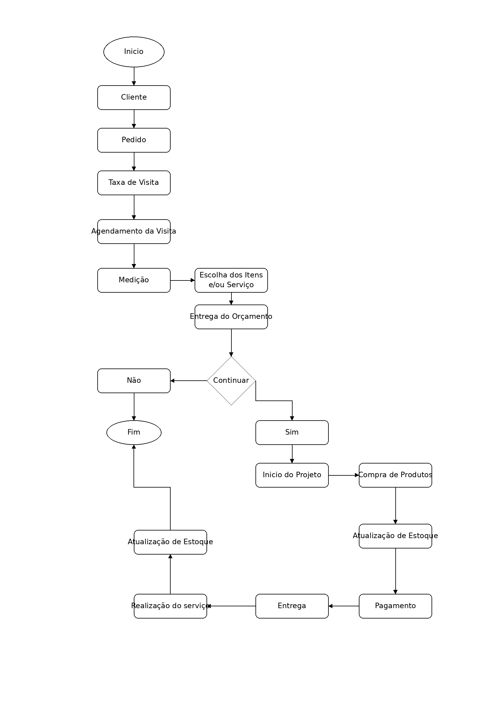
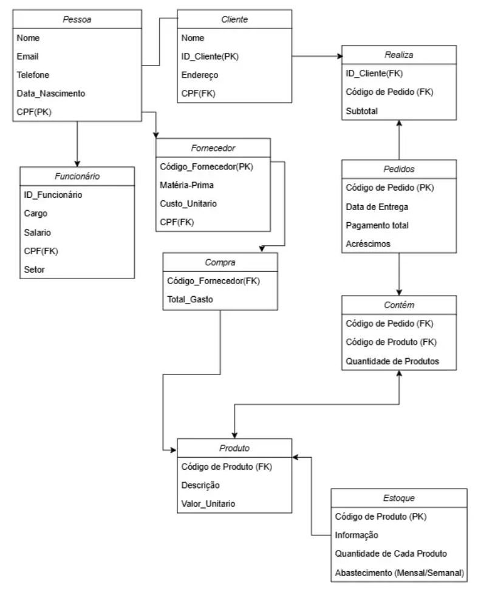

# Projeto ERP — Personal Pisos

## 1. Identificação da equipe
* Bruna Soares de Almeida - RGM: 47552158
* Caua Hernandes Honorato - RGM: 47863617
* Diego Silva - RGM: 47855533
* Esther Mari de Souza - RGM: 47487135
* Felipe Dyonisio da Silva Veiga - RGM: 45698732
* Guilherme de Aquino Campos - RGM: 48183939
* Julia Lafaelly Frazão Nunes - RGM: 48127507
* Marcos Murilo Fernandes da Silva - RGM: 48159786

---

## 2. Caracterização da empresa
* **Nome:** Personal Pisos
* **Segmento:** Design de Interiores e Acabamentos.
* **O que vende:** Soluções completas para ambientação, indo desde revestimentos de piso (vinílicos, laminados, porcelanatos) e proteção solar (persianas, cortinas sob medida) até elementos de decoração geral (papel de parede, tapetes, painéis).
* **Principais Clientes:** Pessoas físicas reformando ou construindo a casa própria, arquitetos/designers de interiores parceiros e pequenos construtores.
* **Setores:** Marketing, Vendas, Gerência, Finanças e Contabilidade, RH e Logística/Instalação.
* **Funcionamento Operacional:** Modelo de negócio híbrido (digital e showroom físico).
* **Dados:** Dados do Cliente, Dados Logísticos, Dados Técnicos e Dados Financeiros.

---

## 3. Justificativa da escolha
O grupo escolheu a empresa porque ela já possui um site que precisa de melhorias estruturais e da implementação de um banco de dados organizado para gerenciar suas informações. Além disso, há facilidade de acesso aos processos reais, pois uma das integrantes atua diretamente na empresa.

---

## 4. Identifique os processos de negócio.
Cliente -- Solicita orçamento -- Projeto -- Agendamento de visita -- Medição -- Compra de produtos -- Pagamento -- Entrega --Montagem/Instalação -- Atualização do estoque. 
 
* **Quem participa?**
Cliente, vendedor, designer de interiores, montador e financeiro. 
* **O que inicia o processo?** 
O cliente solicita um orçamento ou procura um produto específico. 
* **O que acontece?** 
É realizado o orçamento, o projeto é definido e, quando necessário, é agendada uma visita para realizar a medição do ambiente. Após a aprovação, ocorre a compra dos produtos, o pagamento, a entrega e a montagem/instalação. 
* **Que informação é gerada?** 
Orçamento, medidas do ambiente, pedido de venda, produtos vendidos, nota fiscal, comprovante de pagamento e atualização do estoque. 
* **Qual é o resultado?** 
O ambiente do cliente é montado/instalado e a venda é concluída. 

---

## 5. Identifique os problemas e necessidades
* **Onde existe retrabalho?**  
Nas obras, quando acontece algum problema em uma instalação ou serviço que não foi considerado a possibilidade durante a visita técnica realizada pré obra; 
Na administração ou venda quando não foram seguidos todos os processos necessários. 
* **Existem informações duplicadas?**
Poucas, mas existem, pois a loja está reestruturando o sistema. 
* **Existem informações perdidas?**
Às vezes, por isso a loja está modernizando o sistema. 
* **A empresa utiliza planilhas?**
Sim, ela utiliza. 
* **Existem controles manuais?**
Poucos, a empresa investiu mais nos sistemas de ERP e planilhas e agora está modernizando o sistema. 
* **Os setores compartilham informações?**
Sim, compartilham. 
* **É difícil encontrar informações?**
De acordo com as informações passadas pelo dono não é. 
* **Existem erros de cadastro?**
Raramente. 
* **É difícil acompanhar estoque, vendas, clientes ou funcionários?**
Não, desde que esteja tudo devidamente cadastrado. Porém hoje o estoque é algo que dá um pouco mais de trabalho pois a empresa não possui um colaborador específico organizar/catalogar. 
* **Existem problemas para gerar relatórios?**
Não. 
* **PROBLEMAS E NECESSIDADES**
* **Problema**: Problemas não identificados durante a visita técnica pré-obra. 
* **Consequência**: Retrabalho durante a instalação ou execução do serviço; 

* **Problema**: Processos de administração ou venda não seguidos corretamente. 
* **Consequência**: Retrabalho e possíveis atrasos nos processos; 

* **Problema**: Informações duplicadas durante a reestruturação do sistema. 
* **Consequência**: Necessidade de reorganização e conferência dos dados; 

* **Problema**: Possibilidade de perda de informações. 
* **Consequência:** Dificuldade para manter todos os dados organizados e disponíveis; 

* **Problema**: Uso de planilhas junto aos sistemas. 
* **Consequência**: Necessidade de modernização e integração dos controles; 

* **Problema**: Controle de estoque sem colaborador específico. 
* **Consequência**: Maior dificuldade e trabalho para acompanhar o estoque; 

* **Problema**: Informações dependentes de cadastro correto. 
* **Consequência**: Possibilidade de dificuldades no acompanhamento quando há falhas no cadastro.

---

## 6. Requisitos funcionais
* **RF1:** O sistema deve permitir o cadastro de dados pessoais do cliente (E-mail, celular, Nome completo, CPF/CNPJ, Data de nascimento e CEP) com verificação em duas etapas.
* **RF2:** O sistema deve permitir a emissão de relatórios.
* **RF3:** O sistema deve prover um canal de contato direto entre cliente e atendente.
* **RF4:** O sistema deve permitir o controle de estoque.
* **RF5:** O sistema deve permitir a criação de orçamentos prévios de serviço, com validade configurável (ex: 7 dias).
* **RF6:** O sistema deve permitir especificar o estilo de decoração desejado.
* **RF7:** O sistema deve registrar todo o processo, desde a compra do material até a sua venda final.
* **RF8:** O sistema deve registrar quais produtos estão disponíveis para venda.
* **RF9:** O sistema deve calcular o valor total da venda considerando a quantidade de serviços e materiais.

---

## 7. Requisitos não funcionais
* **RNF1:** O sistema deve realizar backup diário automático dos dados.
* **RNF2:** O sistema deve responder às requisições do usuário em tempo hábil (meta de até 0,5 segundos por clique).
* **RNF3:** O sistema deve manter alta disponibilidade (24 horas por dia, 7 dias por semana).
* **RNF4:** O sistema deve possuir interface responsiva (compatível com dispositivos móveis e desktops).
* **RNF5:** O sistema deve estar em conformidade com as diretrizes da LGPD, garantindo o controle de acesso e sigilo das informações dos clientes.

---

## 8. Regras de negócio
* **RN1:** Um mesmo lote/material específico alocado a um pedido não pode ser vendido para mais de um cliente.
* **RN2:** O pagamento parcelado exige um sinal de 35% do valor total da compra.
* **RN3:** O cálculo total do pedido deve somar o valor do material, custos de fornecedores, metragem quadrada e valor da instalação.
* **RN4:** O cancelamento com reembolso total é permitido até 7 dias antes do início da obra/instalação.

---

## 9. Identifique as restrições e políticas organizacionais
* **Quem pode aprovar uma operação?**
Apenas os Gerente/Dono podem realizar operações. 

* **Quem pode alterar determinado cadastro?**
Todos os cadastros podem ser editados pelos clientes, porém somente o gerente pode excluir as informações. 

* **Limites de desconto?**
Toda compra possui um limite de 5 à10% de desconto baseado no valor total da compra. 

* **Condições de pagamento?**
É possível pagar a vista ou parcelado (sendo no parcelado necessário um sinal de 35% e o restante pode ser feito em até 10x sem juros). 

* **Regras de cancelamento**
As regras de cancelamento seguem o Código de Defesa do Consumidor, sendo 7 dias para devolução total do valor gasto e caso já tenha havido algum valor gasto com compra de material, isso será negociado diretamente com o cliente. 

* **Políticas de estoque**
O estoque é conferido uma vez por mês e é abastecido conforme fazem as vendas, pois a loja não trabalha com estoque de todos os produtos. 

* **Regras de acesso às informações**
A loja segue a LGPD - Lei Geral de Proteção de Dados, ou seja, ela informa para que os dados dos clientes serão utilizados, coleta apenas as informações necessárias e possui medidas de segurança contra o vazamento de dados. 

* **Existe alguma decisão da empresa que precisa ser respeitada pelo sistema?**
Sim, algumas coisas são permitidas apenas com autorização do gerente. Como: 
**Desconto maior que 5%;**
**Exclusão de dados do sistema;**
**Outros métodos de pagamento, como boleto.**

---

## 10. Fluxograma dos principais processos

---

## 11. Dicionário de dados conceitual

| Entidade | Atributo | Descrição | Regra / Observação |
| :--- | :--- | :--- | :--- |
| **Pessoa** | `CPF` | Identificador único da pessoa | **PK** - Obrigatório e único |
| **Pessoa** | `Nome` | Nome completo | Obrigatório |
| **Pessoa** | `Email` | Correio eletrônico | Formato de e-mail válido |
| **Pessoa** | `Telefone` | Telefone de contato | Obrigatório |
| **Pessoa** | `Data_Nascimento` | Data de nascimento | Formato Data |
| **Cliente** | `ID_Cliente` | Identificador do cliente | **PK** - Auto incremento |
| **Cliente** | `Endereço` | Endereço completo para entrega | Obrigatório |
| **Cliente** | `CPF` | CPF da pessoa associada | **FK** referenciando `Pessoa(CPF)` |
| **Funcionário** | `ID_Funcionário` | Identificador do funcionário | **PK** |
| **Funcionário** | `Cargo` | Função na empresa | Ex: Vendedor, Gerente |
| **Funcionário** | `Salario` | Remuneração mensal | Valor monetário positivo |
| **Funcionário** | `Setor` | Setor de atuação | Ex: Vendas, Logística |
| **Funcionário** | `CPF` | CPF da pessoa associada | **FK** referenciando `Pessoa(CPF)` |
| **Fornecedor** | `Código_Fornecedor` | Identificador do fornecedor | **PK** |
| **Fornecedor** | `Matéria-Prima` | Descrição do insumo | Texto |
| **Fornecedor** | `Custo_Unitario` | Custo de aquisição do item | Valor monetário |
| **Fornecedor** | `CPF` | Documento do responsável/empresa | **FK** referenciando `Pessoa(CPF)` |
| **Compra** | `ID_Compra` | Registro da ordem de compra | **PK** |
| **Compra** | `Código_Fornecedor` | Código do fornecedor | **FK** referenciando `Fornecedor` |
| **Compra** | `Total_Gasto` | Valor gasto na compra | Valor monetário |
| **Produto** | `Código_Produto` | Código identificador do produto | **PK** |
| **Produto** | `Descrição` | Especificação técnica e nome | Texto |
| **Produto** | `Valor_Unitario` | Preço de venda ao consumidor | Valor monetário |
| **Estoque** | `Código_Produto` | Código do produto em estoque | **PK / FK** referenciando `Produto` |
| **Estoque** | `Informação` | Detalhes do lote e armazenamento | Texto |
| **Estoque** | `Quantidade_De_Cada_Produto` | Unidades/m² em estoque | Numérico inteiro/decimal |
| **Estoque** | `Abastecimento` | Frequência de reposição | Semanal ou Mensal |
| **Pedido** | `Código_Pedido` | Identificador único do pedido | **PK** |
| **Pedido** | `Data_De_Entrega` | Data prevista de instalação/entrega | Formato Data |
| **Pedido** | `Pagamento_Total` | Valor final do pedido | Valor monetário |
| **Pedido** | `Acréscimos` | Custos extras (frete/mão de obra) | Valor monetário |
| **Realiza** | `ID_Cliente` | Código do cliente | **FK** referenciando `Cliente` |
| **Realiza** | `Código_Pedido` | Código do pedido | **FK** referenciando `Pedido` |
| **Realiza** | `Subtotal` | Valor acumulado do cliente no pedido | Atributo próprio do relacionamento |
| **Contém** | `Código_Pedido` | Código do pedido | **FK** referenciando `Pedido` |
| **Contém** | `Código_Produto` | Código do produto | **FK** referenciando `Produto` |
| **Contém** | `Quantidade_De_Produtos` | Quantidade comprada do produto | Numérico |

---

## 12. Entidades
`Pessoa` – `Cliente` – `Funcionário` – `Fornecedor` – `Compra` – `Produto` – `Estoque` – `Pedido` – `Realiza` – `Contém`

---

## 13. Atributos
* **Pessoa:** `Nome` – `Email` – `Telefone` – `Data_Nascimento` – `CPF (PK)`
* **Cliente:** `ID_Cliente (PK)` – `Endereço` – `CPF (FK)`
* **Funcionário:** `ID_Funcionário (PK)` – `Cargo` – `Salario` – `CPF (FK)` – `Setor`
* **Fornecedor:** `Código_Fornecedor (PK)` – `Matéria-Prima` – `Custo_Unitario` – `CPF (FK)`
* **Compra:** `ID_Compra (PK)` – `Código_Fornecedor (FK)` – `Total_Gasto`
* **Produto:** `Código_Produto (PK)` – `Descrição` – `Valor_Unitario`
* **Estoque:** `Código_Produto (PK/FK)` – `Informação` – `Quantidade_De_Cada_Produto` – `Abastecimento`
* **Contém:** `Código_Pedido (FK)` – `Código_Produto (FK)` – `Quantidade_De_Produtos`
* **Pedido:** `Código_Pedido (PK)` – `Data_De_Entrega` – `Pagamento_Total` – `Acréscimos`
* **Realiza:** `ID_Cliente (FK)` – `Código_Pedido (FK)` – `Subtotal`

---

## 14. Relacionamentos

* **Pessoa – Cliente**
  * **Entidades Relacionadas:** Pessoa e Cliente
  * **Tipo de Relacionamento:** Entidade Forte - Entidade Fraca (Especialização / Herança)
  * **Descrição:** A entidade Cliente deriva da entidade genérica Pessoa.
  * **Atributo de Ligação:** `CPF` (Chave Primária em Pessoa e Chave Estrangeira em Cliente)

* **Pessoa – Funcionário**
  * **Entidades Relacionadas:** Pessoa e Funcionário
  * **Tipo de Relacionamento:** Entidade Forte - Entidade Fraca (Especialização / Herança)
  * **Descrição:** A entidade Funcionário deriva da entidade genérica Pessoa.
  * **Atributo de Ligação:** `CPF` (Chave Primária em Pessoa e Chave Estrangeira em Funcionário)

* **Pessoa – Fornecedor**
  * **Entidades Relacionadas:** Pessoa e Fornecedor
  * **Tipo de Relacionamento:** Entidade Forte - Entidade Fraca (Especialização / Herança)
  * **Descrição:** Vincula o cadastro do fornecedor à pessoa física responsável.
  * **Atributo de Ligação:** `CPF` (Chave Primária em Pessoa e Chave Estrangeira em Fornecedor)

* **Cliente – Pedidos (via "Realiza")**
  * **Entidades Relacionadas:** Cliente e Pedido (ligadas através da entidade associativa Realiza)
  * **Tipo de Relacionamento:** Entidade Associativa
  * **Descrição:** Registra quais pedidos foram realizados por determinado cliente, armazenando o subtotal.
  * **Atributos de Ligação:** `ID_Cliente (FK)` e `Código_Pedido (FK)`

* **Pedido – Produto (via "Contém")**
  * **Entidades Relacionadas:** Pedido e Produto (ligadas através da entidade associativa Contém)
  * **Tipo de Relacionamento:** Entidade Associativa
  * **Descrição:** Associa os produtos que fazem parte de cada pedido e a respectiva quantidade de itens.
  * **Atributos de Ligação:** `Código_Pedido (FK)` e `Código_Produto (FK)`

* **Fornecedor – Compra**
  * **Entidades Relacionadas:** Fornecedor e Compra
  * **Tipo de Relacionamento:** Entidade Forte - Entidade Fraca
  * **Descrição:** Registra as compras efetuadas junto a um fornecedor e o total gasto.
  * **Atributo de Ligação:** `Código_Fornecedor` (PK em Fornecedor e FK em Compra)

* **Compra – Produto**
  * **Entidades Relacionadas:** Compra e Produto
  * **Tipo de Relacionamento:** Entidades Fortes (Relacionadas entre si)
  * **Descrição:** Associa as aquisições/compras efetuadas aos produtos do catálogo que alimentam o estoque.
  * **Atributo de Ligação:** `Código_Produto` (Ligação entre as ordens de compra e os produtos)

* **Produto – Estoque**
  * **Entidades Relacionadas:** Produto e Estoque
  * **Tipo de Relacionamento:** Entidade Forte - Entidade Fraca
  * **Descrição:** Associa as informações físicas de estoque, quantidade e periodicidade de abastecimento ao produto correspondente.
  * **Atributo de Ligação:** `Código_Produto` (PK em Produto e PK/FK em Estoque)

---

## 15. Cardinalidades

* **Pessoa -> Cliente / Funcionário / Fornecedor:** `(0,1)` para `(1,1)`. Uma pessoa pode ser cadastrada como cliente, funcionário ou fornecedor.
* **Cliente -> Pedido ("Realiza"):** `(0,N)` para `(1,1)`. Um cliente pode realizar zero ou vários pedidos, mas um pedido pertence a um único cliente.
* **Pedido -> Produto ("Contém"):** `(1,N)` para `(0,N)`. Um pedido contém pelo menos 1 produto e um produto pode estar contido em vários pedidos (Relacionamento N:M).
* **Fornecedor -> Compra:** `(0,N)` para `(1,1)`. Um fornecedor pode estar em várias compras, e cada compra está associada a 1 fornecedor.
* **Produto -> Estoque:** `(1,1)` para `(1,1)`. Cada produto cadastrado possui exatamente 1 registro de controle de estoque correspondente.

---

## 16. Diagrama Entidade-Relacionamento (DER)

---

## 17. Justificativas técnicas das principais decisões de modelagem

1. **Modelagem de `Pessoa` como Entidade Forte e `Cliente`/`Funcionário`/`Fornecedor` como Entidades Fracas:**  
   A entidade forte `Pessoa` centraliza os atributos genéricos (`CPF`, `Nome`, `Email`, `Telefone`, `Data_Nascimento`)[cite: 4]. As entidades `Cliente`, `Funcionário` e `Fornecedor` conectam-se a ela utilizando o `CPF` como Chave Estrangeira (FK)[cite: 4], garantindo a integridade dos cadastros no banco de dados e evitando a duplicação de informações pessoais.

2. **Criação das Entidades Associativas (`Contém` e `Realiza`):**  
   Para resolver os relacionamentos de múltiplos registros sem gerar duplicidade de dados:
   * **`Contém`:** Surge da relação entre `Pedido` e `Produto` para armazenar a `Quantidade_De_Produtos` comprada de cada item no pedido[cite: 4].
   * **`Realiza`:** Conecta `Cliente` a `Pedido`, armazenando o atributo próprio `Subtotal` gerado pela transação do cliente.

3. **Separação entre `Produto` (Entidade Forte) e `Estoque` (Entidade Fraca / Relação 1:1):**  
   O cadastro do `Produto` mantém apenas dados fixos do catálogo (`Descrição`, `Valor_Unitario`)[cite: 4]. O `Estoque` é tratado de forma vinculada (1:1) para controlar dados operacionais e dinâmicos (`Informação`, `Quantidade_De_Cada_Produto`, `Abastecimento`)[cite: 4], permitindo atualizar lotes e saldos sem alterar as especificações fixas do produto.

4. **Definição de `Código_Produto` como Chave Primária (PK) em `Produto`:**  
   Garante que a entidade `Produto` seja independente (entidade forte) e que seu código identificador único possa ser referenciado corretamente como Chave Estrangeira (FK) nas entidades associativas (`Contém`, `Compra`) e no `Estoque`[cite: 4].
---

## 18. Conclusão
Esta entrega estabelece o Modelo Conceitual formal para a Personal Pisos, estruturando os requisitos coletados em entidades, atributos, relacionamentos e regras de negócio. O modelo atende às necessidades operacionais e de gestão da empresa e serve como base sólida para a próxima fase do projeto (Modelo Lógico, Normalização e DDL em Banco de Dados Relacional).
